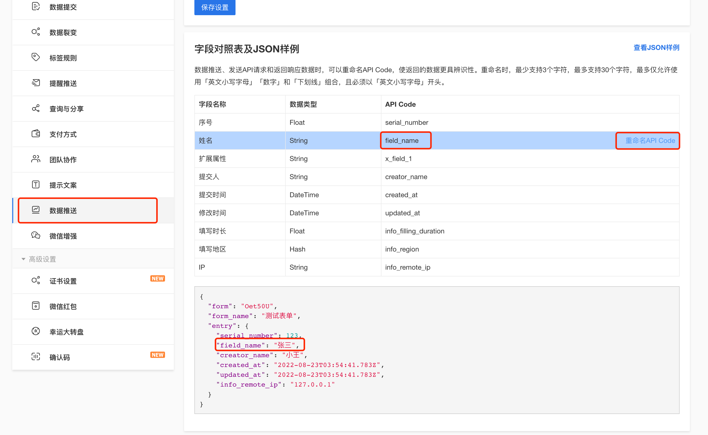

# 重命名 API CODE

**金数据允许用户来重命名表单字段的 API CODE, 以便能从重命名的 API CODE 中来更加明确其字段所表示的含义。**

| 功能 | 免费版 | 专业版/专业增强版 | 企业基础版 | 企业协作版 | 企业高级版 |
| ------ | ------ | ------ | ---- | ---- | ------ |
| 重命名API CODE | | | | ✔️ | ✔️ |

如下图，当我们在`数据推送-字段对照表及JSON样例中`将`姓名`字段默认的`API Code` 从 `field_1` 修改成 `field_name` 之后, 会影响的范围有 Webhook 推送数据, URL 传参, V1 API



## 1. Webhook 推送数据
如下，当姓名字段的 API Code 从 `field_1` 被重命名为 `field_name` 后，通过 Webhook (包括[自动化的Webhook](https://jinshuju.net/features/automation)) 推送的数据如下

```json
{
  "form": "Oet50U",
  "form_name": "测试表单",
  "entry": {
    "token": "HgdvvZx9",
    "serial_number": 1,
    "field_name": "张三", // 注意, 这里的字段 API_CODE 为变成重命名的重命名的 `field_name`
    "x_field_1": "",
    "creator_name": "XXX",
    "created_at": "2022-08-23T05:34:17.873Z",
    "updated_at": "2022-08-23T05:34:17.873Z",
    "info_remote_ip": "113.200.81.42"
  }
}
```

## 2. URL 传参
当使用 [URL 传参时](url_params/overview), 支持使用重命名的 API Code 来传值

例如, 因为 `field_1` 的重命名 API Code 为 `field_name`:
- `https://jinshuju.net/f/TOKEN?field_1=$VALUE$&sign=$SIGNATURE$`
- `https://jinshuju.net/f/TOKEN?field_name=$VALUE$&sign=$SIGNATURE$`   
因此上面两种传参是完全等价的

## 3. V1 API

### 1. 获取单个表单结构
如下，会在之前 field_1 下新增属性用来表示重命名 API_CODE, 如 `field_1` 的重命名code为 `field_name`
```json
{
    "name": "产品需求调研表",
    "description": "感谢您能抽出几分钟时间填写以下内容，现在我们马上开始吧！",
    "fields": [
        {
            "field_1": {
                "label": "姓名",
                "api_code_alias": "field_name",  // 这里会新增加 api_code_alias 来代表 field_1 的重命名 Code
                "type": "single_line_text",
                "notes": "",
                "private": false,
                "validation": {}
            },
            // ...
        }
    ]
}
```

### 2. 获取数据列表
数据列表中，会从[之前的结构](api_v1/endpoints/get_form_entries?id=response)会变成如下
```json
{
    "total": 828,
    "count": 50,
    "data": [
        {
            "serial_number": 1,
            "field_name": "张三",  // 注意, 响应的结果中, 若设置了重命名的 Code, 则有优先使用重命名 Code, `field_name`
            "field_2": "13000000000",
            "info_filling_duration": 28,
            "creator_name": "",
            "created_at": "2020-08-28T08:00:00.000Z",
            "updated_at": "2020-08-28T08:00:00.000Z"
        },
        {
            "serial_number": 2,
            "field_name": "李四",  // 同上
            "field_2": "13000000001",
            "info_filling_duration": 23,
            "creator_name": "子账号",
            "created_at": "2020-08-28T08:00:00.000Z",
            "updated_at": "2020-08-28T08:00:00.000Z"
        }
    ],
    "next": 51
}
```

### 3. 新增单条数据
新增单条数据，会从[之前的结构](api_v1/endpoints/create_form_entry?id=接口描述)会变成如下

#### Request
`POST https://jinshuju.net/api/v1/forms/FORM_TOKEN/entries`

```json
{
    "field_name": "张三",  // 注意, 这里支持使用重命名Code `field_name` 来作为key 
    "field_2": "13000000000"
}
```

#### Response
```json
{
    "form": "a1B2c3",
    "form_name": "产品需求调研表",
    "entry": {
        "serial_number": 28,
        "field_name": "张三",  // 注意, 响应的结果中, 若设置了重命名的 Code, 则有优先使用重命名 Code, `field_name`
        "field_2": "13000000000",
        "x_field_1": "",
        "creator_name": "API调用者",
        "created_at": "2020-08-28T08:00:00.000Z",
        "updated_at": "2020-08-28T08:00:00.000Z"
    }
}
```

### 4. 获取表单单条数据
获取表单单条数据，会从[之前的结构](api_v1/endpoints/get_form_entry?id=接口描述)会变成如下

#### Response
```json
{
    "form": "TOKEN",
    "form_name": "表单标题", 
    "entry": {
        "serial_number": 1,
        "field_name": "张三",  // 注意, 响应的结果中, 若设置了重命名的 Code, 则有优先使用重命名 Code, `field_name`
        "field_2": "13000000000",
        "info_filling_duration": 28,
        "creator_name": "",
        "created_at": "2020-08-28T08:00:00.000Z",
        "updated_at": "2020-08-28T08:00:00.000Z"
    }
}
```

### 5. 修改单条数据
修改单条数据，会从[之前的结构](api_v1/endpoints/update_form_entry?id=接口描述)会变成如下

#### Request
`PATCH/POST/PUT https://jinshuju.net/api/v1/forms/FORM_TOKEN/entries/SERIAL_NUMBER`

```json
{
    "field_name": "张三",  // 注意, 这里支持使用重命名Code `field_name` 来作为key 
    "field_2": "13000000000"
}
```

#### Response
```json
{
    "form": "a1B2c3",
    "form_name": "产品需求调研表",
    "entry": {
        "serial_number": 28,
        "field_name": "张三",  // 注意, 响应的结果中, 若设置了重命名的 Code, 则有优先使用重命名 Code, `field_name`
        "field_2": "13000000000",
        "x_field_1": "",
        "creator_name": "API调用者",
        "created_at": "2020-08-28T08:00:00.000Z",
        "updated_at": "2020-08-28T08:00:00.000Z"
    }
}
```
