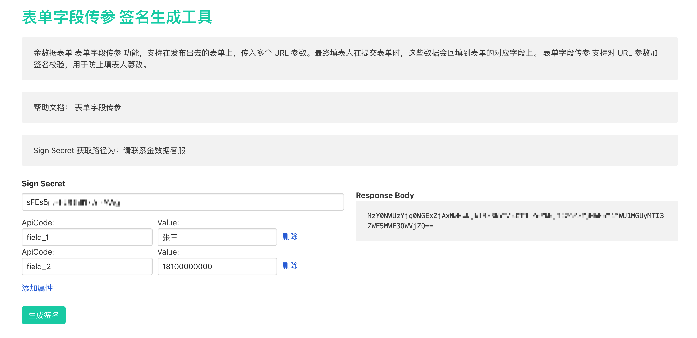

# 金数据 URL 传参 - 表单字段 URL 传参

## 概述

在你的填表人打开金数据表单之前，可能已经经过了你的其他系统的身份认证和权限校验，或者你的其他系统的一些数据收集。如果你希望在填表人打开表单时，将这些信息传入到金数据表单中，无需填表人再次手工输入，可以使用金数据 __表单字段 URL 传参功能__ 。

__表单字段 URL 传参功能__ 需要你在创建表单时，在表单上配置好需要传入数据的字段。例如，你希望将你的系统中的用户姓名和部门传入金数据表单，那么你需要在创建表单时，在表单上添加「用户姓名」和「用户部门」两个字段。（这两个字段可以是「姓名字段」和「单行文本字段」）

## 格式

`https://jinshuju.net/f/TOKEN?field_1=$VALUE$&field_2=$VALUE$&sign=$SIGNATURE$`

其中，`$SIGNATURE$`是数据校验签名

## 特点

* 需要在表单上提前创建好字段
* 支持传入多个字段的值
* 传入的数据，以原始字符串的格式保存
* 支持带有签名校验，防止篡改
* 不同的表单，字段的 API CODE 可能不同
* 数据生成后，支持金数据系统中的所有后续数据管理功能

## 注意

- 目前 __表单字段 URL 传参功能__ 暂时不支持在对外表单填写时的回显。如果需要传递表单字段数据，建议将表单字段设置为隐藏。
- 传入的字段api_code一定要按照 __升序排列__ 进行传参:

##### 正确的示例 - Field API Code升序排列进行传参:

`https://jinshuju.net/f/TOKEN?field_1=$VALUE$&field_2=$VALUE$&field_3=$VALUE$&field_5=$VALUE$&sign=$SIGNATURE$`

- --> **field_1** =call& **field_2** =me& **field_3** =golden& **field_5** =data

##### 错误的示例:

`https://jinshuju.net/f/TOKEN?field_5=$VALUE$&field_3=$VALUE$&field_2=$VALUE$&field_1=$VALUE$&sign=$SIGNATURE$`

- --> **field_5** =data& **field_3** =golden& **field_2** =me& **field_1** =call

## 如何配置

__使用方法__

1. 根据表单结构，获取表单字段的 API CODE
2. 将需要传入的字段按照 key/value 放入 URL
3. 通过你的账户配置的密钥，生成签名

### 如何生成签名

1. 获取你的账户密钥（sign_secret）

> 注：目前只有企业高级版可以使用密钥，请联系你的客户成功经理

2. 将你需要传入的字段 API Code 和 对应的值，按顺序拼接成为 URL 参数

```
url_params = "field_1=VALUE&field_2=VALUE"
```

> 如果 VALUE 中含有特殊字符，则需要进行 URL Encode 转义

3. 通过密钥（sign_secret），使用 HMAC SHA256 对 URL 参数字符串生成签名

```
sign = hmac_sha256(url_params, sign_secret)
```

4. 将生成的 sign 进行 Base64 编码

```
encoded_sign = base64_encode(sign)
```

5. 将 url_params 和 编码后的签名，拼接为最终表单 URl

```
https://jinshuju.net/f/TOKEN?field_1=VALUE&field_2=VALUE&sign=encoded_sign
```

### 在线校验工具
你可以使用我们提供的在线 表单字段传参签名生成工具 来在线生成和校验, 地址: https://jsj-api.jinshujuapp.com/url_parameter_tests/new



## 示例代码

### 伪代码

```
form_token = "YOUR_FORM_TOKEN"

sign_secret = "123456"

url_params = "field_1=James&field_2=13888888888"

sign = SHA256(url_params, sign_secret)

encoded_sign = Base64.encode(sign)

final_url = "https://jinshuju.net/f/${form_token}?${url_params}&sign=${encoded_sign}"
```

### Java

```java
import javax.crypto.Mac;
import javax.crypto.spec.SecretKeySpec;
import java.nio.charset.StandardCharsets;
import java.security.InvalidKeyException;
import java.security.NoSuchAlgorithmException;
import java.util.Base64;
import java.util.Comparator;
import java.util.TreeMap;
import java.util.stream.Collectors;

public class Main {

    public static void main(String[] args) throws NoSuchAlgorithmException, InvalidKeyException {
        TreeMap<String, Object> payload = new TreeMap<>(Comparator.naturalOrder());
        payload.put("field_1", "James");
        payload.put("field_2", "13888888888");

        String urlParams = payload.keySet().stream().map(key -> key + "=" + payload.get(key)).collect(Collectors.joining("&"));

        String signSecret = "123456";

        String encodedSign = generateEncodedSign(signSecret, urlParams);

        String formToken = "YOUR_FORM_TOKEN";

        System.out.printf("https://jinshuju.net/f/%s?%s&sign=%s", formToken, urlParams, encodedSign);
    }

    private static String generateEncodedSign(String signSecret, String urlParams) throws NoSuchAlgorithmException, InvalidKeyException {
        char[] hexArray = "0123456789abcdef".toCharArray();
        Mac sha256HMAC = Mac.getInstance("HmacSHA256");
        SecretKeySpec secretKey = new SecretKeySpec(signSecret.getBytes(StandardCharsets.UTF_8), "HmacSHA256");
        sha256HMAC.init(secretKey);
        byte[] data = sha256HMAC.doFinal(urlParams.getBytes(StandardCharsets.UTF_8));

        // to hex start
        int l = data.length;
        char[] out = new char[l << 1];
        int i = 0;
        for (int var5 = 0; i < l; ++i) {
            out[var5++] = hexArray[(240 & data[i]) >>> 4];
            out[var5++] = hexArray[15 & data[i]];
        }
        // end

        return Base64.getEncoder().encodeToString(new String(out).getBytes(StandardCharsets.UTF_8));
    }
}
```

### Python

```python
from urllib.parse import urlencode, unquote
import hmac
import hashlib
import base64
import collections

form_token = "YOUR_FORM_TOKEN"

sign_secret = "123456"

payload = {'field_1': 'James', 'field_2': '13888888889'}

ordered_payload = collections.OrderedDict(sorted(payload.items()))

url_params = unquote(urlencode(ordered_payload))

sign = hmac.new(bytes(sign_secret, 'utf-8'), msg=bytes(url_params, 'utf-8'), digestmod=hashlib.sha256).hexdigest()

encoded_sign = base64.b64encode(bytes(sign, 'utf-8')).decode("utf-8")

final_url = f"https://jinshuju.net/f/{form_token}?{url_params}&sign={encoded_sign}"

print(final_url)
```

### Ruby

```bash
require 'uri'
require 'base64'
require 'openssl'

form_token = 'YOUR_FORM_TOKEN'

sign_secret = '123456'

payload = {field_1: 'James', field_2: '13888888888'}

ordered_payload = payload.sort_by { |k, _v| k.split('_').last.to_i }.to_h

url_params = ordered_payload.each_with_object({}) do |(key, value), memo|
  memo[key] = URI.decode(value.to_s)
end.sort.map do |key, value|
  "#{key}=#{value}"
end.join('&')

sign = OpenSSL::HMAC.hexdigest('sha256', sign_secret, url_params)

encoded_sign = Base64.strict_encode64(sign)

final_url = "https://jinshuju.net/f/#{form_token}?#{url_params}&sign=#{encoded_sign}"

puts final_url
```
